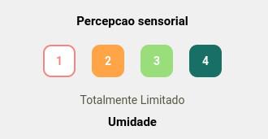

# Modelo de input para formulario

O modelo constitue de uma logica e uma visualizacao, para simplificacao termos genericos foram utilizados.

*obs: o ideal seria a criacao de um coponente proprio para tal...*

**exemplo de input**


**modelo para a logica:**
```js
const [valor, setValor] = useState(1)
const [texto, setTexto] = useState('TEXTO 1')

// setando botao 1
const [button1, setButton1] = useState({
    width: 40,
    height: 40,
    marginHorizontal: 10,
    marginVertical: 20,
    borderRadius: 10,
    backgroundColor: '#fff', // este vai ser mudado constantemente :P
    borderColor: '#F28585',
    borderWidth: 2,
    alignItems: 'center',
    justifyContent: 'center'
})
const [button1Text, setButton1Text] = useState({
    color: '#F28585', // este ira mudar constantemente!!
    fontSize: 14,
    fontWeight: 'bold'
})

// setando botao 2
const [button2, setButton2] = useState({
    width: 40,
    height: 40,
    marginHorizontal: 10,
    marginVertical: 20,
    borderRadius: 10,
    backgroundColor: '#FFA447',
    borderColor: '#FFA447',
    borderWidth: 2,
    alignItems: 'center',
    justifyContent: 'center'
})
const [button2Text, setButton2Text] = useState({
    color: '#fff',
    fontSize: 14,
    fontWeight: 'bold'
})

// setando botao 3
const [button3, setButton3] = useState({
width: 40,
height: 40,
marginHorizontal: 10,
marginVertical: 20,
borderRadius: 10,
backgroundColor: '#9ADE7B',
borderColor: '#9ADE7B',
borderWidth: 2,
alignItems: 'center',
justifyContent: 'center'
})
const [button3Text, setButton3Text] = useState({
color: '#fff',
fontSize: 14,
fontWeight: 'bold'
})

// setando botao 4
const [button4, setButton4] = useState({
width: 40,
height: 40,
marginHorizontal: 10,
marginVertical: 20,
borderRadius: 10,
backgroundColor: '#186F65',
borderColor: '#186F65',
borderWidth: 2,
alignItems: 'center',
justifyContent: 'center'
})
const [button4Text, setButton4Text] = useState({
color: '#fff',
fontSize: 14,
fontWeight: 'bold'
})

// lidar com a troca dos botoes
const changeButton = (buttonId) => {
switch (buttonId) {

    // quando mudar para o botao 1
    case 1:
    setValor(1)
    setTexto('TEXTO 1')

    // setando o botao atual
    setButton1(prevState => ({
        ...prevState,
        backgroundColor: '#fff'
    }))
    setButton1Text(prevState => ({
        ...prevState,
        color: '#F28585'
    }))

    // setando os botoes ao original
    setButton2(prevState => ({
        ...prevState,
        backgroundColor: '#FFA447'
    }))
    setButton2Text(prevState => ({
        ...prevState,
        color: '#fff'
    }))

    setButton3(prevState => ({
        ...prevState,
        backgroundColor: '#9ADE7B'
    }))
    setButton3Text(prevState => ({
        ...prevState,
        color: '#fff'
    }))

    setButton4(prevState => ({
        ...prevState,
        backgroundColor: '#186F65'
    }))
    setButton4Text(prevState => ({
        ...prevState,
        color: '#fff'
    }))
    break;

    // quando mudar para o botao 2
    case 2:
    setValor(2)
    setTexto('TEXTO 2')

    // setando o botao atual
    setButton2(prevState => ({
        ...prevState,
        backgroundColor: '#fff'
    }))
    setButton2Text(prevState => ({
        ...prevState,
        color: '#FFA447'
    }))

    // setando os botoes ao original
    setButton1(prevState => ({
        ...prevState,
        backgroundColor: '#F28585'
    }))
    setButton1Text(prevState => ({
        ...prevState,
        color: '#fff'
    }))

    setButton3(prevState => ({
        ...prevState,
        backgroundColor: '#9ADE7B'
    }))
    setButton3Text(prevState => ({
        ...prevState,
        color: '#fff'
    }))

    setButton4(prevState => ({
        ...prevState,
        backgroundColor: '#186F65'
    }))
    setButton4Text(prevState => ({
        ...prevState,
        color: '#fff'
    }))
    break;

    // quando mudar para o botao 3
    case 3:
    setValor(3)
    setTexto('TEXTO 3')

    // setando o botao atual
    setButton3(prevState => ({
        ...prevState,
        backgroundColor: '#fff'
    }))
    setButton3Text(prevState => ({
        ...prevState,
        color: '#9ADE7B'
    }))

    // setando os botoes ao original
    setButton1(prevState => ({
        ...prevState,
        backgroundColor: '#F28585'
    }))
    setButton1Text(prevState => ({
        ...prevState,
        color: '#fff'
    }))

    setButton2(prevState => ({
        ...prevState,
        backgroundColor: '#FFA447'
    }))
    setButton2Text(prevState => ({
        ...prevState,
        color: '#fff'
    }))

    setButton4(prevState => ({
        ...prevState,
        backgroundColor: '#186F65'
    }))
    setButton4Text(prevState => ({
        ...prevState,
        color: '#fff'
    }))
    break;

    // quando mudar para o botao 4
    case 4:
    setValor(4)
    setTexto('TEXTO 4')

    // setando o botao atual
    setButton4(prevState => ({
        ...prevState,
        backgroundColor: '#fff'
    }))
    setButton4Text(prevState => ({
        ...prevState,
        color: '#186F65'
    }))

    // setando os botoes ao original
    setButton1(prevState => ({
        ...prevState,
        backgroundColor: '#F28585'
    }))
    setButton1Text(prevState => ({
        ...prevState,
        color: '#fff'
    }))

    setButton2(prevState => ({
        ...prevState,
        backgroundColor: '#FFA447'
    }))
    setButton2Text(prevState => ({
        ...prevState,
        color: '#fff'
    }))

    setButton3(prevState => ({
        ...prevState,
        backgroundColor: '#9ADE7B'
    }))
    setButton3Text(prevState => ({
        ...prevState,
        color: '#fff'
    }))
    break;

    default:
    break;
}
}
```

**modelo do view**
```js
<View style={styles.formInputs}>

    {/* label */}
    <Text style={styles.formLabel}>LABEL EXEMPLO</Text>

    {/*****************************************/}
    {/* botoes do formulario */}
    <View style={{ flexDirection: 'row' }}>

        <TouchableOpacity style={button1} onPress={() => changeButton(1)}>
        {/* este texto vai ser alterado e lido pelo useState constantemente */}
        <Text style={button1Text}>1</Text>
        </TouchableOpacity>

        <TouchableOpacity style={button2} onPress={() => changeButton(2)}>
        <Text style={button2Text}>2</Text>
        </TouchableOpacity>

        <TouchableOpacity style={button3} onPress={() => changeButton(3)}>
        <Text style={button3Text}>3</Text>
        </TouchableOpacity>

        <TouchableOpacity style={button4} onPress={() => changeButton(4)}>
        <Text style={button4Text}>4</Text>
        </TouchableOpacity>
    </View>
    {/* botoes do formulario */}
    {/*****************************************/}

    {/* resultado */}
    <Text style={styles.formResultado}>{texto}</Text>
</View>
```

**a estilizacao do form**
```js
  formInputs: { 
    alignItems: 'center', 
    marginTop: 10 
  },

  formLabel: { 
    fontSize: 15, 
    fontWeight: 'bold'
  },
```

